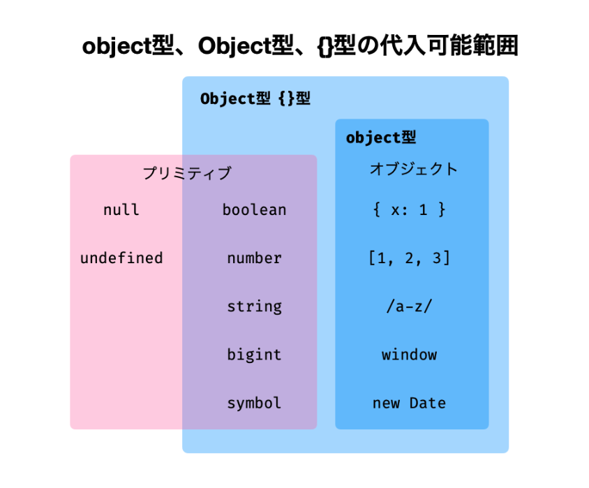
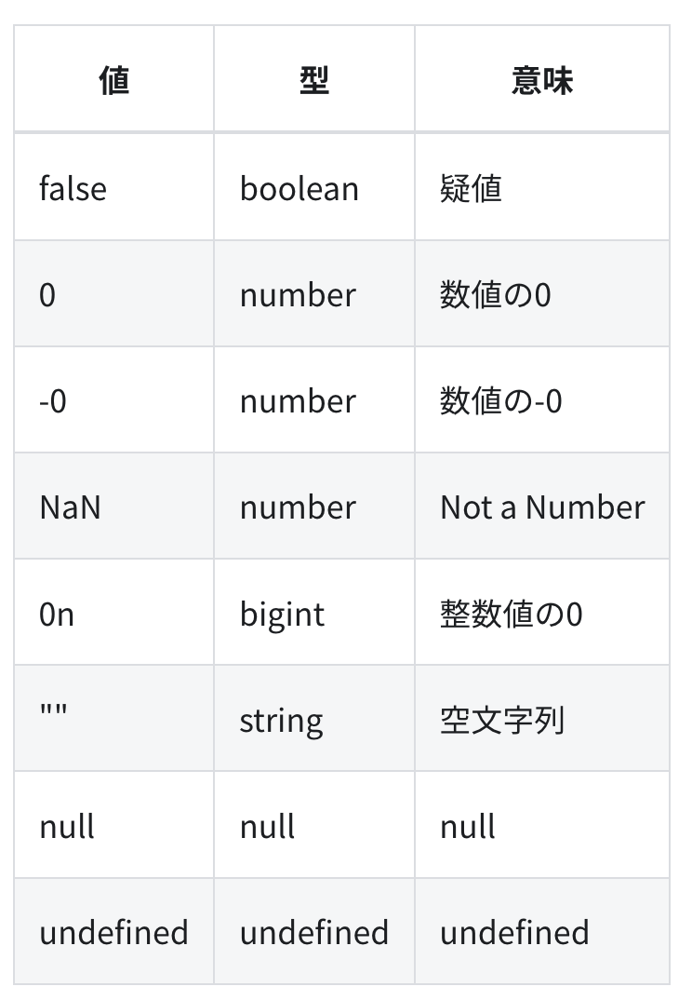

# compiler
- 型注釈

```typescript
function increment(n: number) {
  return n + 1;
}
```

- tscコマンドでコンパイル
- コンパイルすると.jsファイルが生成される

# javascript概要

## 変数宣言

```javascript
// let
let a = 1;
a = 2;

// const
const b = 1;
b = 2; // error

// constはプロパティを普遍にできない
const o = { a: 1 };
o = { b: 2 }; // error
o.a = 2; // ok
```

- tsでオブジェクトを普遍にする
```typescript
let o: {
  readonly foo: number
}
o = {foo: 1};
o.foo = 2; // error
```

- tsで配列を不変にする

```typescript
const nums: readonly number[] = [1,2,3];
```

## 型推論
```typescript
let x = 1;
x = "hello"; // error
```

## primitive型
- 値を直接変更できない（immutable）
- プロパティを持たない
  - 文字列などのプリミティブ型は例外

```javascript
"name".length // 4
```

- 種類
  - boolean
  - number
  - string
  - undifined
  - null
  - symbol
  - bigint

## number
- 数値リテラル

```typescript
1
-1
1.2

0.1 === .1
1.0 === 1.
```

```typescript
// bit
0b1010 // 0bから始まる
// byte
0o755 // 0oから始まる
// hex
0xfff // 0xから始まる
```

- 区切り文字
```typescript
100_000_000 // １億
```

- 数値リテラルのプロパティを参照する

```typescript
1.toString()   // error
1..toString()  // ok
(1).toString() // ok
```

- サイズは64bit
  - 52bitが値
  - 11bitが少数点の位置
  - 1bitが符号に

```typescript
// numberの範囲
min = -(2^53 − 1) 
max = (2^53 − 1)
```

### 特殊な数値
- NaN
  - not a number

```typescript
const price = parseInt("百円")
price // NaN
Number.IsNan(price) // true
```

```typescript
NaN ==  NaN // false
NaN === NaN // false
```

- Infinity
  - 無限大

## 少数計算の誤差

```typescript
0.1 + 0.2 === 0.3 // false
```

- 0.2をbitで表すと循環小数（0.0011...）になるため発生する
- ２進数で循環小数にならなければ誤差は発生しない

```typescript
0.5 + 0.25 === 0.75 // true
```

- 誤差を解決するために一度整数にしてから計算する
  - 整数の計算は誤差が生じない

```typescript
110 * 1.1       === 121; // false
(110 * 11) / 10 === 121; // true
```

- decimal.jsのようなパッケージを使うのもアリ

# string型

- リテラル
```typescript
// 全部同じ！
"Hello"; 
'Hello'; 
`Hello`;
```

- テンプレートリテラル

```typescript
const count = 10;
console.log(`現在、${count}名が見ています。`);
```

- リテラルにどれを使うか？
1. 基本的に"を使用する
2. 文字列の中に"が含まれる場合は'を使用する
3. 文字列展開する必要があるときは`を使用する

## 型注釈
```typescript
const msg: string = "hello";
```
- 名前が似ている`String`型もあるので注意！

# null型
- 型注釈

```typescript
const n: null = null;
```

- `typeof`演算子の注意点

```typescript
- null に対してtypeofを使うとobjectが返る
console.log(typeof null); // object
```

# undefined
```typescript
let name;
name; // undefined
 
function func() {}
func(); // undefined
 
const obj = {};
obj.name; // undefined
 
const arr = [];
arr[1]; // undefined
```

- リテラル
 - undefinedは実は変数（グローバルのような）なので、リテラルは無い

- 型注釈

```typescript
const x: undefined = undefined;
```

# undefinedとnullの違い
- nullは自然発生しない
- undefinedは変数
- typeof

```typescript
typeof undefined; // undefined
typeof null;      // object
```
- json

```typescript
JSON.stringify({ foo: undefined }); // {}
JSON.stringify({ foo: null });      // {"foo": null}
```

- どちらを使用するべきか？
 - 諸説アリすぎるテーマ
 - どちらかに統一する（このチュートリアルではundefinedを推奨）

# symbol型
- プリミティブ型

```typescript
const s1 = Symbol("foo");
const s2 = Symbol("foo");
s1 === s1; // true
s1 === s2; // false
```

- 型注釈

```typescript
const s: symbol = Symbol();
```

- symbolを駆使してコードを書く機会はあまりない。。。

# bigint型

- リテラル

```typescript
const x = 100n;
```

- 型注釈

```typescript
const x: bigint = 100n;
```

- BigInt関数

```typescript
const x = BigInt(100);
const y = BigInt("9007199254740991");
```

- 演算
  - bigintに合わせるのが無難

```typescript
2n + 3; // error

2n + BigInt(3); // 5n
```

# 型強制

```typescript
"1" - 1; // 0
"1" + 1; // "11"
```

# ボックス化（boxing）
- プリミティブ型は一般的にはフィールド・メソッドを持たない
- オブジェクトのように処理したいときはboxingする

```typescript
const str = "foo";
const strObj = new String(str); // boxing
strObj.length; // field
strObject.toUpperCase(); // method
```

- 自動ボックス化
  - jsではプリミティブ型でもフィールド・メソッドが参照できる
  - jsが内部で自動的にString型に変換しているから

```javascript
const str = "foo";
str.length;
str.toUpperCase();
```

- ラッパーオブジェクト

| primitive型 | wrapper obj |
| ----------- | ----------- |
| boolean     | Boolean     |
| string      | String      |
| symbol      | Symbol      |
| bigint      | Bigint      |

- nullとundefinedにはラッパーオブジェクトが無い

- typescriptにもラッパーオブジェクトがある
  - ラッパーオブジェクトにプリミティブ型を代入できる

```typescript
const flg: Boolean = false;
// ラッパーオブジェクト型をプリミティブに代入できない！
const flg2: boolean = flg; // error
```

- ラッパーオブジェクト型は演算子が使えない

```typescript
const num: Number = 1;
num * 2; // error
```

- ラッパーオブジェクト型には、インターフェイスを満たしていればプリミティブ型以外も代入できる

```typescript
const boolLike = {
  valueOf(): boolean {
    return true;
  },
};

const flg: Boolean = boolLike;
```

- 型注釈にラッパーオブジェクト型を使うメリットは無い

```typescript
// bad
const num1: Number;
// good
const num2: number;
```

# リテラル型

```typescript
let x: 1;
x = 1;
x = 100; // error
```

- リテラル型として使えるもの
  - boolean
  - number
  - string

```typescript
const isTrue: true = true;
const num: 123 = 123;
const str: "foo" = "foo";
```

- union型に用いられる
```typescript
let num: 1 | 2 | 3 = 1;
```

# any型
- 何でもOKな型
- any型を使うとコンパイラがチェックしなくなるので注意

```typescript
const str: any = 123;
str.toLowerCase();
```

- 暗黙のany
  - 型を省略してコンテキストから型推論できない時、tsは暗黙的にany型として扱う

```typescript
// nameはanyになる
function hello(name) {
  console.log(`Hello, ${name.toUpperCase()}`);
}
 
hello(1); // error
```

  - 暗黙のanyを許さないために`tsconfig.json`を設定
    - `noImplicitAny: true`

# オブジェクト
- jsではプリミティブ型以外のものは全てオブジェクト型

## プロパティ
```typescript
const product = {
  name: "ミネラルウォーター",
  price: 100,
  getTaxIncludedPrice: function () {
    return Math.floor(this.price * 1.1);
  },
  shomikigen: new Date("2022-01-20"),
};
```

- メソッド
```typescript
const object = {
  // キーと値に分けて書いたメソッド定義
  printHello1: function () {
    console.log("Hello");
  },
  // 短い構文を用いたメソッド定義
  printHello2() {
    console.log("Hello");
  },
};
```

- jsではフィールドとメソッドの区別をしっかりしていない

## 型注釈

```typescript
let box: {width: number; heigt: number;};
box = {width: 20, height: 40};
box = {width: "20", height: 40}; // error
box = {height: 40}; // error
```

- プロパティの区切り文字には`,`も使えるが`;`推奨
  - コード整形ツールの利便性から

- 型エイリアスを使った例

```typescript
type Box = { width: number; height: number };
let box: Box = { width: 1080, height: 720 };
```

- メソッドの型注釈

```typescript
let calculator: {
  sum(x: number, y: number): number;
};
 
calculator = {
  sum(x, y) {
    return x + y;
  },
};
```

- 型推論

```typescript
let box = { width: 1080, height: 720 };
box.foo = "foo"; // error
```

- Record<Keys, Type>
  - 連想配列のようなオブジェクト型を定義する時、ユーティリティ型の`Record`を使う

```typescript
let foo: Record<string, number>;
foo = {a: 1, b: 2};
```

- object型
  - 非推奨（フィールドの制約ができないから）
  - 型注釈に

```typescript
let box: object;
```

## readonly
```typescript
let obj: {
  readonly foo: number;
};
obj = { foo: 1 };
obj.foo = 2; // error
```

- readonlyは再帰的では無い

```typescript
let obj: {
  readonly foo: {
    bar: number;
  };
};
obj = {
  foo: {
    bar: 1,
  },
};
obj.foo = { bar: 2 }; // error
obj.foo.bar = 2; // コンパイルエラーにはならない
```

- 一括でreadonlyにする
  - ユーティリティ型のReadonlyを使用

```typescript
let obj: Readonly<{
  a: number;
  b: number;
  c: number;
  d: number;
  e: number;
  f: number;
}>;
```

## オプションプロパティ
```typescript
let size: { width?: number };
size = {};                 // ok
size = {width: undefined}; // ok
size = {width: null};      // error
```

## 余剰プロパティチェック
- オブジェクト型に存在しないプロパティを持つオブジェクトの代入を禁止

```typescript
let onlyX: { x: number };
onlyX = { x: 1 }; // OK
onlyX = { x: 1, y: 2 }; // コンパイルエラー
```

- 余剰プロパティチェックは変数代入には働かない

```typescript
const xy: { x: number; y: number } = { x: 1, y: 2 };
let onlyX: { x: number };
onlyX = xy; // OK
```

## index型

- フィールド名を指定しない
```typescript
let obj: {
  [K: string]: number;
};
 
obj = { a: 1, b: 2 }; // OK
obj.c = 4; // OK
obj["d"] = 5; // OK
```

- コンパイラーオプションの`noUncheckedIndexedAccess`を有効にすると、プロパティの型は自動的に指定した型とundefinedのユニオン型になる

```typescript
const obj: { [K: string]: number } = { a: 1 };
const b: number | undefined = obj.b;
console.log(b); // undefined
```

- Record<K, T>を用いたindex型
  - 以下は同じ意味

```typescript
let obj1: { [K: string]: number };
let obj2: Record<string, number>;
```

## プロトタイプベース

- オブジェクトの生成方法
  - 言語ごとで異なる
  - クラスベースとプロトタイプベースがある

### クラスベース
- オブジェクトの設計図であるクラスを使用する

### プロトタイプベース
- クラスが無い
- オブジェクトからオブジェクトを生成する（何言ってるかわからん）

```javascript
const button = {
  name: "ボタン",
};
 
const dangerousButton = Object.create(button);
dangerousButton.name = "絶対に押すなよ？";
```

- プロトタイプ（原型）を元にオブジェクトを生成するアプローチ

### 継承
- クラスベースでは `extends` キーワードを使って継承

```javascript
class Counter {
  constructor() {
    this.count = 0;
  }
 
  countUp() {
    this.count++;
  }
}

class ResettableCounter extends Counter {
  reset() {
    this.count = 0;
  }
}

counter = new ResettableCounter();
counter.countUp();
counter.reset();
```

- プロトタイプベースではプロトタイプとなるオブジェクトが継承できる

```javascript
const counter = {
  count: 0,
  countUp() {
    this.count++;
  },
};
 
const resettableCounter = Object.create(counter);
resettableCounter.reset = function () {
  this.count = 0;
};
```

- jsではクラスベース風にもかけるようになっている

## object, Object, {}の違い
- ざっくりオブジェクトであることを示す

```typescript
let a: object;
let b: Object;
let c: {};
```

- object型と他2つには異なる点がある
### object型
- プリミティブ型以外が代入可

```typescript
let a: object;
a = { x: 1 }; // OK
a = [1, 2, 3]; // OK。配列はオブジェクト
a = /a-z/; // OK。正規表現はオブジェクト
 
// プリミティブ型はNG
a = 1;
```

### Object型
- インターフェース
- `valueOf`プロパティを持つ値なら代入可

```typescript
let a: Object;
a = {}; // OK
 
// ボックス化可能なプリミティブ型OK
a = 1; // OK
a = true; // OK
a = "string"; // OK
 
// nullとundefinedはNG
a = null;
a = undefined;
```

- Object型は使用するべきではない

### {}型

- プロパティを持たないオブジェクトを表す
- null, undefined以外を代入可

```typescript
let a: {};
a = {}; // OK
 
// ボックス化可能なプリミティブ型OK
a = 1; // OK
a = true; // OK
a = "string"; // OK
 
// nullとundefinedはNG
a = null;
a = undefined;
```

  

## 分割代入
- `{}`に取り出したいプロパティを指定することで、プロパティ名と同じ名前の変数が作れる

```typescript
const item = {price: 100};
// cosnt price = item.priceと同義
const {price} = item;

const obj = {a: 1, b: 2};
const {a,b} = obj;
```

- 代入する変数名の指定

```typescript
const obj = {a: 1, b: 2, c: 3};
const { a: aa, b: bb, c: cc} = obj;
```

- ネストした分割代入

```typescript
const foo = {
  a: "foo",
  b: {
    c: "bar",
    d: "bazz"
  }
}
const {
  a,
  b: { c, d }
} = foo;

a // foo
c // bar
d // bazz
```

- 分割代入のデフォルト値
  - 値がnullのときはデフォルト値にならないので注意

```typescript
const { a = 0, b = 0} = obj;
```

## shorthand property names
- キーと変数名が同じ場合の省略記法

```typescript
type Wild = {
  name: string;
  no: number;
  genre: string;
  height: number;
  weight: number;
};
 
const name = "pikachu";
const no = 25;
const genre = "mouse pokémon";
const height = 0.4;
const weight = 6.0;
 
const pikachu: Wild = {
  name,
  no,
  genre,
  height,
  weight,
};
```

## オプショナルチェーン
- オプショナルチェーン`?.`は、おb樹エクとのプロパティが存在しない場合でも、エラーを起こさない

```typescript
// function
const fn = undefined;
fn?.();

const book = undefined;
// property
const title = book?.title;
// method
book?.Read()

// array
arr?.[0];
```

- オプショナルチェーンを使用した場合は、得られる値の型は`undefined`とのユニオン型になる

```typescript
number | undefined
```

- Null合体演算子
  - オプショナルチェーンが`undefined`を返したときにデフォルトの値を設定
  - Null合体演算子`??`を用いる

```typescript
const book = undefined;
const title = book?.title ?? "default value";
```

## ループ

### for-in

```typescript
const obj = {a: 1, b: 2};
for (const prop in obj) {}
```

- jsでは全てのオブジェクトが`Object.prototype`を継承
- プロトタイプを変更すると、全てのオブジェクトに影響する

```typescript
const foo = { a: 1 };
const date = new Date();
const arr = [1, 2, 3];
 
// どのオブジェクトもhiプロパティが無いことを確認
console.log(foo.hi, date.hi, arr.hi);
 
// プロトタイプにプロパティを追加する
Object.prototype.hi = "Hi!";
 
// どのオブジェクトもhiプロパティを持つようになる
console.log(foo.hi, date.hi, arr.hi);
```

- for-inではプロトタイプのプロパティも含めてループする仕様

```typescript
const foo = { a: 1, b: 2, c: 3 };
Object.prototype.hi = "Hi!";
for (const prop in foo) {
  console.log(prop, foo[prop]);
  // a 1
  // b 2
  // c 3
  // hi Hi! の順で出力される
}
```

- なので`hasOwnProperty`を使用すること推奨

```typescript
const foo = { a: 1, b: 2, c: 3 };
Object.prototype.hi = "Hi!";
for (const prop in foo) {
  if (Object.prototype.hasOwnProperty.call(foo, prop)) {
    console.log(prop, foo[prop]);
    // a 1
    // b 2
    // c 3  の順で出力される
  }
}
```

- 以下のようにすれば、`hasOwnProperty`チェックは不要

```typescript
const foo = {a:1, b: 2, c: 3};
for (const [key, value] of Object.entries(foo)) {
}
```

## 構造的部分型

- オブジェクト指向の継承に関する話
  - 基本型: supertype
  - 派生型: subtype
- 派生型の方式には以下がある
  - 公称型(nominal typing)
  - 構造的部分型(structual subtyping)

### 公称型
- java, c++など
- ある型を基本型にする派生型は互いに置換できない

### 構造的部分型
- golang, typescript
- その型の見た目（シグネチャ）が等しければ置換可能

### 例
- 公称型

```java
public class InputSource {
  public Data fetch() {
    // ...
    return data
  }
}

public class File extends InputSource {
  public Data fetch() {
    // ...
    return data
  }
}

public class Request extends InputSource {
  public Data fetch() {
    // ...
    return data
  }
}

final Request source3 = new File(); // error
final File source4 = new Request(); // error
```

- 構造的部分型の場合

```typescript
class File extends InputSource {
  public fetch(): Data {
    // ...
    return data
  }
}

class Request extends InputSource {
  public fetch(): Data {
    // ...
    return data
  }
}

// ok
const source3: Request = new File("/data/~~~.txt");
const source4: File = new Request("https://~~~~");
 // ok
const data3: Data = source3.fetch();
const data4: Data = source4.fetch();
```
- File, RequestはInputSourceのようなインターフェイスであると解釈されるので可能

```typescript
interface InputSource {
  fetch(): Data;
}
```

- スーパークラスが異なっている場合でも起こりうる

```typescript
class File {
  public destination: string;
 
  public constructor(destination: string) {
    this.destination = destination;
  }
 
  public fetch(): Data {
    const reader: Reader = FileSystem.readFrom(this.destination);
    // ...
 
    return data;
  }
}
 
class Request {
  public destination: string;
 
  public constructor(destination: string) {
    this.destination = destination;
  }
 
  public fetch(): Data {
    const response: Response = HTTPRequest.get(this.destination);
    // ...
 
    return data;
  }
}

// ok
const source3: Request = new File("/data/~~~.txt");
const source4: File = new Request("https://~~~~");
// ok
const data3: Data = source3.fetch();
const data4: Data = source4.fetch();
```

## 配列

```typescript
const arr = [1,3];
arr[100]; // undefined
```

- 要素アクセスで得た値はTypeかundefinedだが、コンパイラは常にType型だと解釈する

```typescript
const arr = ["a", "b"];
arr[4].toUpperCase(); // Cannot read properties of undefined (reading 'toUpperCase')
```

- コンパイラオプションの `noUncheckedIndexedAccess`を有効に

```typescript
const abc: string[] = ["a", "b", "c"];
const character: string | undefined = abc[0];
character.toUpperCase(); // コンパイラでエラー
```

## 読み取り専用配列
- readonlyを使用

```typescript
const arr: readonly number[] = [1,2,3];
```

- ReadonlyArray<T>

```typescript
const arr: ReadonlyArray<number> = [1,2,3];
```

- どちらも違いは無い
- 読み取り専用配列は、破壊的なメソッド`push``pop`メソッドがコンパイル時に無いことになる
- コンパイル後のjsにはあるのでコンパイルエラーを無視すれば。。。

## 配列の分割代入

```typescript
cosnt arr = [1,2,3];
const [one,two,three]=arr;
```

- ネストした配列

```typescript
const twoByTwo = [
  [1, 2],
  [3, 4],
];
const [[one, two], [three]] = twoByTwo;
console.log(one);   // 1
console.log(two);   // 2
console.log(three); // 3
```

- 途中だけ欲しい

```typescript
const oneToFive = [1, 2, 3, 4, 5];
const [, , , four, five] = oneToFive;
console.log(four);
console.log(five);
```

- 残余部分

```typescript
const oneToFive = [1, 2, 3, 4, 5];
const [one, ...rest] = oneToFive;
console.log(one);
console.log(rest);
```

## array loop

- for

```typescript
const arr = ["a", "b", "c"];
for (let i = 0; i < arr.length; i++) {
  if (arr[i] === "a") {
    continue;
  }
  console.log(arr[i]);
  // b c が順に出力される
}
```

- for-of

```typescript
const arr = ["a", "b", "c"];
for (const value of arr) {
  console.log(value);
  // a b cの順で出力される
}
```

- Array.forEach

```typescript
const arr = ["a", "b", "c"];
arr.forEach((value, i) => {
  console.log(value, i);
  // a 0
  // b 1
  // c 2 の順で出力される
});
```

- for-inは使わない

```typescript
const arr = ["a", "b", "c"];
arr.foo = "bar"; // 追加のプロパティ
for (const x in arr) {
  console.log(x, arr[x]);
  // 0 a
  // 1 b
  // 2 c
  // foo bar が順に出力される
}
```

## 共変
- その型、その部分型が代入できること

```typescript
interface Animal {
  isAnimal: boolean;
}

interface Dog extends Animal {
  isDog: boolean;
}

let pochi: Dog = {isAnimal: true, isDog: true};
let animal: Animal = pochi; // ok

let animal2 = {isAnimal: true};
let hana: Dog = animal2; // error
```

- 配列は共変が許される

```typescript
const dogs: Dog[] = [pochi];
const animals: Animal[] = dogs; // 代入OK
```

- 以下のような点に注意！

```typescript
interface Animal {
  isAnimal: boolean;
}
interface Dog extends Animal {
  wanwan(): string; // メソッド
}
 
const pochi = {
  isAnimal: true,
  wanwan() {
    return "wanwan"; // メソッドの実装
  },
};
 
const dogs: Dog[] = [pochi];
const animals: Animal[] = dogs;
animals[0] = { isAnimal: true }; // 同時にdogs[0]も書き換わる
const mayBePochi: Dog = dogs[0];
mayBePochi.wanwan();
// JS実行時エラー: mayBePochi.wanwan is not a function
```

## タプル(tuple)
- tsでは関数は一つの値のみ返す
- 複数の値を返したい場合は配列を使用

```typescript
function tuple() {
  //...
  return [1, "ok", true];
}
```

- この時の型をどうする？
  - `any[]`や`unknown[]`?
  - 以下のような問題も。。。

```typescript
list[0].toString(); // Object is of type 'unknown'.
```

```typescript
const list: [number, string, boolean] = tuple();
```

- タプルへのアクセス

```typescript
const list: [number, string, boolean] = tuple();
list[100]; // error
```

- 使用する場面
  - 非同期プログラミングをする時に、`Promise.all()`を使用する
  - その時に使う

# 列挙型（enum）
```typescript
enum Position {
  Top, // 0
  Right, // 1 
  Bottom, // 2
  Left // 3
}
```

- 値を代入できる
```typescript
enum Position {
  Top = 1, // 1
  Right, // 2
  Bottom, // 3
  Left, // 4
}
```

- 文字列も使える

```typescript
enum Direction {
  Up = "UP",
  Down = "DOWN",
  Left = "LEFT",
  Right = "RIGHT",
}
```

## 列挙型の問題点
- 数値の列挙型には数値なら何でも代入可能

```typescript
enum ZeroOrOne {
  Zero = 0,
  One = 1,
}
const zeroOrOne: ZeroOrOne = 9; // コンパイルエラーは起きません！
```

- メンバーにない値へのアクセス

```typescript
enum ZeroOrOne {
  Zero = 0,
  One = 1,
}
 
console.log(ZeroOrOne[0]); // これは期待どおり
console.log(ZeroOrOne[9]); // これはコンパイルエラーになってほしいところ…
```

- 文字列列挙型だけ公称型

```typescript
enum StringEnum {
  Foo = "foo",
}
const foo1: StringEnum = StringEnum.Foo; // コンパイル通る
const foo2: StringEnum = "foo"; // コンパイルエラーになる
```

## 列挙型の代替案

### ユニオン型

```typescript
type YesNo = "yes" | "no";
 
function toJapanese(yesno: YesNo) {
  switch (yesno) {
    case "yes":
      return "はい";
    case "no":
      return "いいえ";
  }
}
```

- シンボルを使った例

```typescript
const yes = Symbol();
const no = Symbol();
type YesNo = typeof yes | typeof no;
 
function toJapanese(yesno: YesNo) {
  switch (yesno) {
    case yes:
      return "はい";
    case no:
      return "いいえ";
  }
}
```

### オブジェクトリテラルを使用

```typescript
const Position = {
  Top: 0,
  Right: 1,
  Bottom: 2,
  Left: 3,
} as const;
 
type Position = typeof Position[keyof typeof Position];
// 上は type Position = 0 | 1 | 2 | 3 と同じ意味になります
 
function toJapanese(position: Position) {
  switch (position) {
    case Position.Top:
      return "上";
    case Position.Right:
      return "右";
    case Position.Bottom:
      return "下";
    case Position.Left:
      return "左";
  }
}
```

# ユニオン型
```typescript
let numberOrUndefined: number | undefined;

type ErrorCode =
  | 400
  | 401
  | 402
  | 403
  | 404
  | 405;
  
// array
type List = (string | number)[];
```

- `string | null` がnullかどうか判定したい時はtsの絞り込み（narrowing）を使用

```typescript
const maybeUserId: string | null = localStorage.getItem("userId");
 
const userId: string = maybeUserId; // nullかもしれないので、代入できない。
 
if (typeof maybeUserId === "string") {
  const userId: string = maybeUserId; // この分岐内では文字列型に絞り込まれるため、代入できる。
}
```

## 判別可能なユニオン型
- 各オブジェクトで識別可能なプロパティをもつこと
  - 例ではtypeがstring型ではなくて、リテラル型になっている
- このプロパティを`ディスクリミネータ`という


```typescript
type UploadStatus = InProgress | Success | Failure;
type InProgress = { type: "InProgress"; progress: number };
type Success = { type: "Success" };
type Failure = { type: "Failure"; error: Error };

function printStatus(status: UploadStatus) {
  switch (status.type) {
    case "InProgress":
      console.log(`アップロード中:${status.progress}%`);
      break;
    case "Success":
      console.log("アップロード成功", status);
      break;
    case "Failure":
      console.log(`アップロード失敗:${status.error.message}`);
      break;
    default:
      console.log("不正なステータス: ", status);
  }
}
```

- ディスクリミネータにはリテラル型と`null`,`undefined`が使える

# インターセクション型
- ユニオン型が **どれか** を意味するならインターセクション型は **どれも**
- 合体したいオブジェクト同士を `&`で列挙

```typescript
type Never = string & number;
const n: Never = "2"; // error
```

- インターセクション型の使い所
- 巨大なオブジェクトがあるとする

```typescript
type Parameter = {
  id: string;
  index?: number;
  active: boolean;
  balance: number;
  photo?: string;
  age?: number;
  surname: string;
  givenName: string;
  company?: string;
  email: string;
  phoneNumber?: string;
  address?: string;
  // ...
};
```

- ユーティリティ型の`Required<T>`と`Partial<T>`を使ってわかりやすくする
- 必須とオプションに分割

```typescript
type Mandatory = {
  id: string;
  active: boolean;
  balance: number;
  surname: string;
  givenName: string;
  email: string;
};
 
type Optional = {
  index: number;
  photo: string;
  age: number;
  company: string;
  phoneNumber: string;
  address: string;
};
```

- `Required<T>` `Partial<T>`を使用

```typescript
type Mandatory = Required<{
  id: string;
  active: boolean;
  balance: number;
  surname: string;
  givenName: string;
  email: string;
}>;
 
type Optional = Partial<{
  index: number;
  photo: string;
  age: number;
  company: string;
  phoneNumber: string;
  address: string;
}>;
```

- 合体

```typescript
type Parameter = Mandatory & Optional;
```

# 型エイリアス

```typescript
type Alias = string|number;
const value: Alias = 1; // ok
```

# 型アサーション(as)
- コンパイラの型推論を上書きする
- `as`を使った書き方

```typescript
const value: string | number = "this is a string";
const strLength: number = (value as string).length;
```

- アングルブラケット構文を使った書き方

```typescript
const value: string | number = "this is a string.";
const strLength: number = (<string>value).length;
```

- `number`を`string`にする型アサーションはコンパイルエラー

```typescript
const num = 1;
const str = num as string; // error
```
- `unknown`型を経由すれば突破できるｗ

```typescript
const num = 1;
const str: string = num as unknown as string; // ok
```

# constアサーション(as const)

- オブジェクトリテラルの最後に`as const`を指定すれば、プロパティが`readonly`で指定した事と同様になる

```typescript
const pikachu = {
  name: "pikachu",
  no: 25,
  genre: "mouse pokémon",
  height: 0.4,
  weight: 6.0,
} as const;

pikachu.name = "raichu"; // error
```

- const assertionは再帰的にreadonlyにできる

```typescript
const america = {
  name: "North American Continent",
  canada: {
    name: "Republic of Canada",
    capitalCity: "Ottawa",
  },
  us: {
    name: "United States of America",
    capitalCity: "Washington, D.C.",
  },
  mexico: {
    name: "United Mexican States",
    capitalCity: "Mexico City",
  },
} as const;

america.name = "African Continent"; // error
// error
america.canada = {
  name: "Republic of Côte d'Ivoire",
  capitalCity: "Yamoussoukro",
};
america.canada.name = "Republic of Côte d'Ivoire"; // error
```

## definite assignment assertion
- コンパイラオプション: strictNullChecks
  - 初期化されていない変数を参照した際にエラーを出す

## strictPropertyInitialization
- TypeScriptでは次のコンパイラオプションの両方がtrueのとき、クラスのプロパティが初期化されていないとエラーを出します。
  - strictNullChecks
  - strictPropertyInitialization
- tsはプロパティ定義またはconstructorでプロパティが初期化されているか判断する

```typescript
class Foo {
  num1: number = 1; // 初期化している
  num2: number;
  num3: number;
 
  constructor() {
    this.num2 = 1; // 初期化している
    this.initNum3(); // num3を初期化している
  }
 
  initNum3() {
    this.num3 = 1;
  }
}
```

## definite assignment assertion
- 変数やプロパティの初期化が確実に行われていることをコンパイラに伝えるには、definite assignment assertionを使う

```typescript
let num!: number;
//     ^definite assignment assertion
initNum();
console.log(num * 2); // エラーにならない
function initNum() {
  num = 2;
}
```

## 非Nullアサーション(non-null assertion)
```typescript
let num: number;
initNum();
console.log(num! * 2); // エラーにならない
//             ^非Nullアサーション
function initNum() {
  num = 2;
}
```

- **definite assignment assertionとnon-null assertionはなるべく使わないほうが良い**

# typeof

```typescript
typeof "foo" // string
// nullの場合注意！
typeof null // object
```

- やばい実装

```typescript
// まずい実装
function isObject(value) {
  return typeof value === "object"; // valueがnullになる場合を考慮していない
}
 
isObject(null); // 戻り値がtrueになってしまう
```

- nullを考慮した実装

```typescript
function isObject(value) {
  return value !== null && typeof value === "object";
}
```

## 配列を判別

- Array.isArray()を使う
- typeofではobjectになる

# 等価

## 厳密等価演算子（===）
- 型と値が等しいこと

```javascript
null === undefined // false
0 === 0n // false
0 === "0" // false
```

## 等価演算子（==）

- 型が異なる場合は変換を試みる
- その結果が等しいか？

```javascript
null == undefined // true
0 == 0n // true
0 == "0" // true
0 == "" // true
0 == false // true
"0" == false // true
"" == false // true
```

## 注意

```typescript
NaN == NaN // false
Symbol("foo") == Symbol("foo") // false
{} == {} // false
```

## truthy, falsyな値
- jsでは真偽値ではなくてもifの対象にできる

- falsyな値

  

- 注意点

```typescript
const array = [null, 3, 0, null, 1, 2];
// nullだけを取り除くつもりだった！
console.log(array.filter((n) => n));
```

- eslintにifブロックでboolean以外が渡されると怒られるオプションある
  - strict-boolean-expression

# スコープ

## グローバルスコープ
- jsではwindowと呼ばれるグローバルオブジェクトがある
- グローバル変数はwindowのプロパティ
- グローバル変数へのアクセスはwindowを省略してかける

```typescript
Date === window.Date; //=> true
console === window.console; //=> true
```

- local scope以外でvarで変数宣言するとグローバル変数になるｗ
- (jsでは)local変数を定義した場合にlet, constを忘れた場合はグローバル変数になるｗ

# switch
- switchでは厳密等価
- break必須
- caseの変数スコープは無い

```typescript
let x = 1;
switch (x) {
  case 1:
    const sameName = "A";
    break;
  case 2:
    const sameName = "B"; // error
    break;
}
```

- caseに変数スコープを作る

```typescript
let x = 1;
switch (x) {
  case 1: {
    const sameName = "A";
    break;
  }
  case 2: {
    const sameName = "B";
    break;
  }
}
```

# 例外処理
```javascript
try {
  throw new Error("something wrong");
} catch (e) {
  // something wrong
  console.log(e.message);
}
```

- throwは何でも投げれるが、アンチパターン

```typescript
throw "foobar";
```

- catchの変数の型はany

```typescript
try {
  // ...
} catch (e) { // any
  // ...
}
```

- TypeScriptのコンパイラーオプションのuseUnknownInCatchVariablesを有効にすると、catchの変数の型がunknown型になる
- 「どんな値がthrowされるか分からない」ことを型として正確に表現できる

- finally
  - 例外発生の有無に関わらず実行

# never型
- 値を持たない型
- 何も代入できない
- never型は代入できる

```typescript
let foo never;
foo = 1; // error
foo = 1 as never;
```

- 何にでも代入できる

```typescript
const foo: never = 1;
const a: string = foo;
const b: string[] = foo;
```

## 使い所

- 必ず例外が発生する関数
```typescript
function throwError(): never {
  throw new Error();
}
```

- 終了しない関数

```typescript
function forever(): never {
  while(true) {}
}
```

- 作り得ない値
  - 数値と文字列のインターセクション型はneverになる

```typescript
type numString = number & string; // never
```

## voidとの違い

- 戻り値がない点は同じ
- voidは関数が最後まで処理されるという意味

## neverを使った網羅性チェック
- 網羅性の無い分岐でnever型を使う

```typescript
type Extension = "js" | "ts" | "json";

function print(ext: Extension) {
  switch (ext) {
    case "js":
      console.log("JavaScript");
      break;
    case "ts":
      console.log("TypeScript");
    // case "json":
    //   console.log("JSON")
    //   break;
    default:
      const check: never = ext;
      break;
  }
}
```

- 網羅性チェック用の例外クラスも推奨

```typescript
class ExhaustiveError extends Error {
  constructor(value: never, message = `Unsupported type: ${value}`) {
    super(message);
  }
}
```

```typescript
function printLang(ext: Extension): void {
  switch (ext) {
    case "js":
      console.log("JavaScript");
      break;
    case "ts":
      console.log("TypeScript");
      break;
    default:
      throw new ExhaustiveError(ext);
  }
}
```

- この実装のメリット
  1. noUnusedLocalsに対応
  2. 実行時を意識したコードに?(よくわからｎ)

1. noUnusedLocalsに対応
- 下の実装ではコンパイラオプションのnoUnusedLocalsで叱られる
  
```typescript
default:
      const check: never = ext; // 'exhaustivenessCheck' is declared but its value is never read.
      break;
```

2. よくわからないので
https://typescriptbook.jp/reference/statements/never

